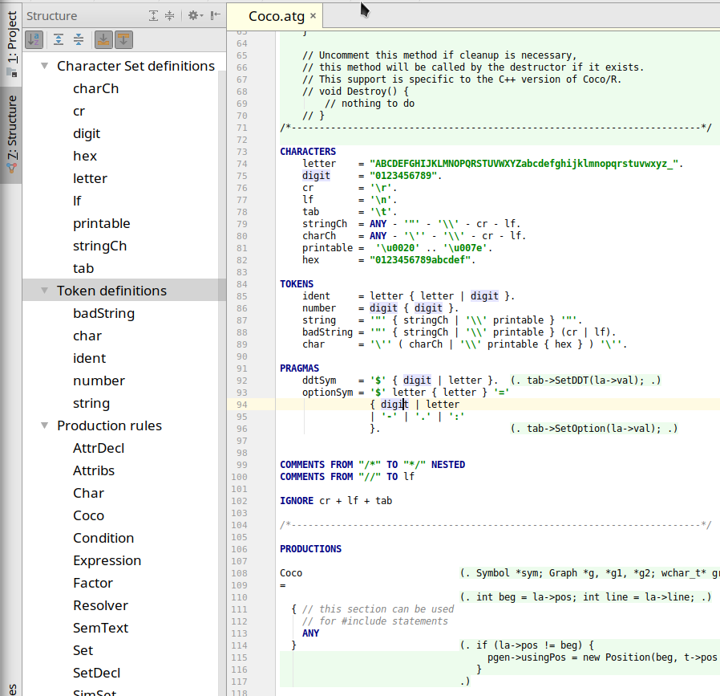

# Coco/R grammar support for Jetbrains IDEs

Plugin for [Jetbrains](https://www.jetbrains.com/) IDEs
to support grammar files (\*.atg) of the [Coco/R](http://ssw.jku.at/Coco/) compiler generator.
Check it out from [Jetbrains' plugin repository](https://plugins.jetbrains.com/idea/plugin/9457-coco-r-grammar-support).

## Implementation

Following the [Custom Language Support Tutorial](http://www.jetbrains.org/intellij/sdk/docs/tutorials/custom_language_support_tutorial.html), the lexer is generated from Coco.flex using JFlex, and the parser from Coco.bnf using [Grammar-Kit](https://github.com/JetBrains/Grammar-Kit).

# TODOs
* language injection
    - configurable language and/or good guess
    - prefix & suffix as needed
    - file header

- references: not resolved in IGNORE, COMMENTS, PRAGMAS
- customizable syntax highlighting: [Color Settings Page](http://www.jetbrains.org/intellij/sdk/docs/tutorials/custom_language_support/syntax_highlighter_and_color_settings_page.html)
    - syntax highlighting: different colors for keywords, charsets, tokens, productions
- PRAGMAs in structure view
- `$CNF` file header

- code completion, templates, "new file" (template), build system integration, quick fix ...

# Tutorial deficits
- "register" occurs in plugin.xml
- for references: methods from .bnf are delegated to psiImplUtilClass, *if signature fits*
- bnf: methods(nonterminals)=[] are not resolved correctly in "attributes" header
- bug in `SimpleStructureViewModel.isAlwaysLeaf`: `element instanceof SimpleFile` is always false, it should be `treeElement.psiElement instanceof ...`
- `PsiReference.resolve()` is only called when you return a valid value from `.rangeInsideHost()` (which `PsiReferenceBase` does *not* do)

What may help understanding the tutorial:
- Rust [JFlex Lexer](https://github.com/intellij-rust/intellij-rust/blob/master/src/main/grammars/RustLexer.flex) and [Grammar-Kit Parser](https://github.com/intellij-rust/intellij-rust/blob/master/src/main/grammars/RustParser.bnf)
- Monkey C [Grammar-Kit Parser](https://github.com/liias/monkey/blob/master/src/main/java/io/github/liias/monkey/lang/grammar/Monkey.bnf)
- meta-plugin for using ANTLR-grammar in jetbrains IDEs: [Code](https://github.com/antlr/jetbrains) and [forum announcement](https://intellij-support.jetbrains.com/hc/en-us/community/posts/206103369-Using-ANTLR-v4-to-lex-parse-custom-file-formats)

## howto language embedding, other plugins & forum posts

[This thread about the *Play!* plugin](https://intellij-support.jetbrains.com/hc/en-us/community/posts/206780275-Example-of-a-custom-language-plugin-for-a-templating-language)[^1] explains the differences between the three possible embedding "types":

- LanguageSubstitutor: replace Language of an already handled file (e.g. HTML) with your own lang
    * <https://intellij-support.jetbrains.com/hc/en-us/community/posts/207106595-Python-like-selectable-templating-laguages> (Perl?)
- Language injection: embed your language (fragments) in already handled file, e.g. properties in Java string[^2]
    *  Documentation for [Language Injections](https://www.jetbrains.com/help/idea/2016.3/using-language-injections.html). References from embedded fragments are explained [in the tutorial](http://www.jetbrains.org/intellij/sdk/docs/tutorials/custom_language_support/reference_contributor.html#define-a-reference-contributor)
    * <https://intellij-support.jetbrains.com/hc/en-us/community/posts/206483119-Java-code-Injection-in-custom-language-> (CUP)
    * <https://intellij-support.jetbrains.com/hc/en-us/community/posts/206020584-Language-Plugin-for-a-Thymeleaf-like-templating-language> (HTL, but there are other plugins for HTL, too)
- MultiplePsiFilesPerDocumentFileViewProvider: create several different Psi trees for one file. Have to use a layered Lexer (like [Scala](https://github.com/JetBrains/intellij-scala/blob/32dd1c4/src/org/jetbrains/plugins/scala/lang/lexer/LayeredLexer.java) or *Latte*)?
    * <https://intellij-support.jetbrains.com/hc/en-us/community/posts/206765105-Tutorial-Custom-templating-language-plugin> (Latte)
    * <https://intellij-support.jetbrains.com/hc/en-us/community/posts/207316255-FindUsages-in-MultiPsiTree-files> (Perl/Pod), [Perl plugin dev thread](https://intellij-support.jetbrains.com/hc/en-us/community/posts/206102159-Perl5-plugin-for-Intellij-IDEA)
    * <https://intellij-support.jetbrains.com/hc/en-us/community/posts/207231009-ERB-like-template-language> (Elixir/ERB)
    * <https://github.com/JetBrains/intellij-plugins/blob/master/handlebars/src/com/dmarcotte/handlebars/file/HbFileViewProvider.java> (Handlebars)
    * thoughts on multiple languages' parser interaction <https://intellij-support.jetbrains.com/hc/en-us/community/posts/207645985-language-composition-with-Grammar-Kit->
    * how to implement references between different language Psis <https://intellij-support.jetbrains.com/hc/en-us/community/posts/205990364-References-between-HTML-fragments-and-custom-template-language> (another HTL plugin)

The last paragraph in [Custom Language Tutorial/Lexer](http://www.jetbrains.org/intellij/sdk/docs/reference_guide/custom_language_support/implementing_lexer.html) tells about mixing languages using chameleon tokens implementing `ILazyParseableElementType`, probably that's the method with multiple Psi files.
- <https://intellij-support.jetbrains.com/hc/en-us/community/posts/206124409-Confucion-of-ILazyParseableElementType>, <https://intellij-support.jetbrains.com/hc/en-us/community/posts/204145984-Index-stub-and-IReparseableElementType>

[^1]: For *Play!* see also <https://groups.google.com/forum/#!topic/play-framework/fB-2SXtlYfc>
